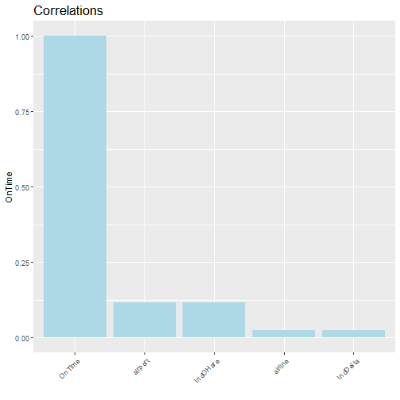

Airlines (Stat2Data) dataset 
========================================================
author: Arturo Prieto Tirado
date: 29/01/2021
autosize: true
font-import: https://fonts.googleapis.com/css2?family=Akaya+Kanadaka&display=swap
font-family: 'Akaya Kanadaka' 

The dataset 
========================================================
incremental: true

Describes 10333 OnTime arrivals for American and Delta airlines at LaGuardia (New York) and O'Hare (Chicago) airports using 5 categorical variables:

- Airline : Either American or Delta
- Airport : Either LGA=La Guardia or ORD=O'Hare
- On time : Yes or no
- IndOHare: Is the airport ORD? (1=yes or 0=no)
- IndDelta: Is the airline Delta? (1=yes or 0=no)

Variable Distribution 
========================================================
transition: fade

Variable Distribution 2
========================================================
incremental:true
transition:fade
- 71 % of the flights belong to American Airlines and 29% to Delta.

- 45% of the flights arrived to La Guardia and 55% to Chicago O'Hare

- 80% of the flights arrived on time

- IndOHare and IndDelta contain the same information as airline and airport

Correlations
========================================================

Able to study if flights are delayed or not. See correlations with respect to OnTime.

Conclusions
===============================================================
incremental:true

- Redundant variables like IndOHare and IndDelta are just 0/1 binary representations on the binary categorical variables airport and airline.

- Punctuality can be a variable of interest for study. However, there is low correlation and few variables, so it would be interesting to expand the dataset with many more variables and/or more important ones to build models.
